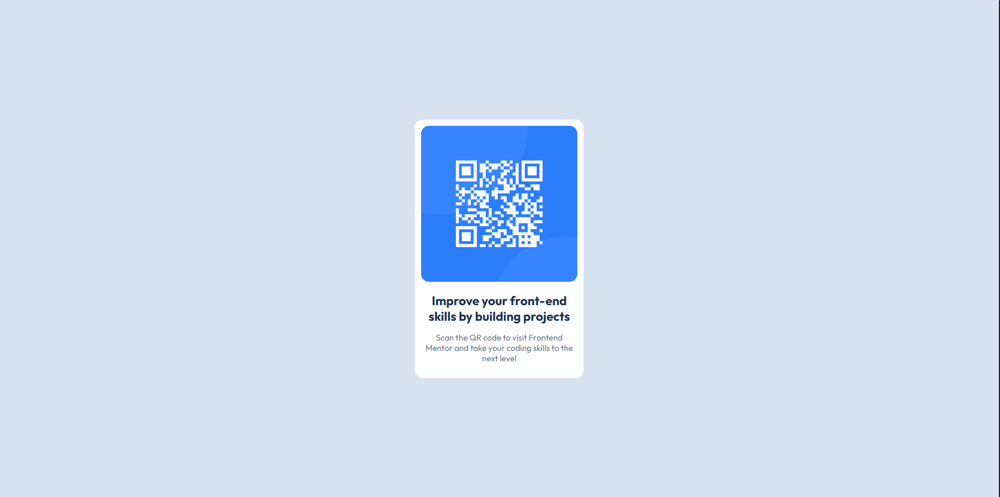

# Frontend Mentor - QR code component solution

I want to get more comfortable with HTML/CSS. This is a solution to the [QR code component challenge on Frontend Mentor](https://www.frontendmentor.io/challenges/qr-code-component-iux_sIO_H). Frontend Mentor challenges help you improve your coding skills by building realistic projects.

### Screenshot

### Links

- [Solution URL](https://github.com/jmcintosh24/qr-code-component)
- [Live Site URL](https://jmcintosh24.github.io/qr-code-component/)

### What I learned

In this challenge I learned the basic boilerplate setup and format of an HTML document. I also learned basic elements like 
  <h1-h6> and 
. Through researching online I discovered the difference between block and inline elements, though I am still a bit confused on how this corresponds to the visual layout. I find it confusing to know when an element is considered a block or inline.

I was able to use CSS to get the layout to match the design. I learned about the different unit values available for fields like px, %, em, vh, etc.
